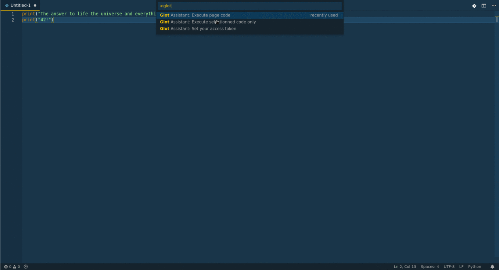

# Glot Assistant

Quickly run code with Glot.io.

Select the code you want to execute and get the results in a bit!
Glot supports many languages: Python, Ruby, C, C++, C#... (see more here: https://glot.io/)

Glot Assistant is not affiliated to Glot.io in anyway.

## Features

* Execute either the whole document or a specific part of your code
* Get the standards and errors outputs straight away
* Set your own Glot.io instance instead of the official one (run.glot.io)

## Configuration

In order to use Glot.io services, you need a token. To get one,
follow those steps:

1) Create an account on https://glot.io/
2) Grab a token on https://glot.io/account/token
3) Execute "Glot Assistant: Set your access token" to set your token

If you don't want to use the official Glot.io server, you can specify a new one by
either setting it manually in your settings (see below) or calling the "Glot Assistant: Set your server address" command.

## Extension Settings

* `glotAssistant.token`: required token to communicate with the Glot.io API
* `glotAssistant.server`: address of your Glot.io server - by default: run.glot.io
